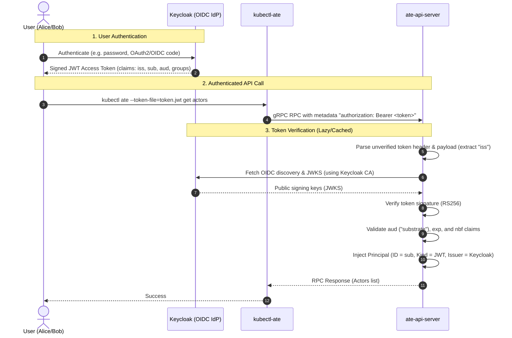

# Keycloak Authentication Provider Demo

This directory demonstrates how to use **Keycloak** as an external OpenID Connect (OIDC) identity provider for **Agent Substrate**.

Substrate's control plane (`ateapi`) accepts bearer JWT tokens alongside mTLS certificates. By configuring Keycloak as a trusted JWT provider, users authenticated through Keycloak can issue commands to the Substrate API via `kubectl-ate` or direct gRPC calls.

---

## Architecture & Authentication Flow



### How Substrate Validates Keycloak Tokens

1. **Bearer Extraction**: `ateapi` extracts the bearer token from the incoming gRPC `authorization` metadata header.
2. **Issuer Matching**: It inspects the `iss` claim in the unverified token payload and looks up the corresponding provider entry in `ateapi`'s `--authentication-config` (mounted from ConfigMap `ate-api-authentication` in namespace `ate-system`).
3. **OIDC Discovery**: `ateapi` queries `${issuer}/.well-known/openid-configuration` to discover the `jwks_uri`. If Keycloak is running with an internal TLS certificate, `ateapi` uses the configured `certificateAuthorityFile` to establish trust.
4. **Signature & Claim Verification**:
   - Signature is verified against Keycloak's public keys in its JWKS endpoint.
   - Audience (`aud`) is checked to ensure it matches at least one configured audience (e.g. `substrate`).
   - Timestamps (`exp`, `nbf`, `iat`) are validated against current time with a small allowed clock skew.
5. **Principal Injection**: The caller's `sub` claim is injected into the request context as the authenticated principal.

---

## Directory Layout

```
demos/keycloak/
├── README.md                      # This guide
├── generate-certs.sh              # Generates TLS certs and CA for Keycloak
├── patch-substrate-authn.sh       # Merges Keycloak provider into ate-api-authentication
├── get-token.sh                   # Helper script to fetch user tokens from Keycloak
└── config/
    ├── keycloak.yaml              # Kubernetes Deployment and Service for Keycloak
    ├── realm-configmap.yaml       # Serialized Keycloak realm with groups and users
    └── substrate-authn-config.yaml# Reference ConfigMap showing the Keycloak JWT provider
```

---

## Demo Users, Groups, and Clients

The serialized realm (`substrate-realm.json` in `config/realm-configmap.yaml`) pre-configures the following entities:

### Users

| Username | Password | Email | Groups | Description |
|---|---|---|---|---|
| `alice` | `alicepassword` | `alice@example.com` | `/admins`, `/developers` | Platform administrator & developer |
| `bob` | `bobpassword` | `bob@example.com` | `/developers` | Agent developer |
| `charlie` | `charliepassword` | `charlie@example.com` | `/viewers` | Read-only auditor |

### Groups & Roles

- **`/admins`**: Associated with realm role `admin`.
- **`/developers`**: Associated with realm role `developer`.
- **`/viewers`**: Associated with realm role `viewer`.

### Client

- **Client ID**: `substrate-cli`
- **Access Type**: Public client with Direct Access Grants enabled (allowing straightforward CLI token retrieval via password grant) and standard authorization code flow enabled.
- **Protocol Mappers**:
  - `substrate-audience-mapper`: Injects audience `"substrate"` into all issued access and ID tokens.
  - `groups-mapper`: Injects user group memberships into the `"groups"` claim in tokens.

---

## Step-by-Step Walkthrough

### Prerequisites

- A running Kubernetes cluster with Agent Substrate installed (`ate-system` namespace active).
- `kubectl` configured with cluster admin permissions.
- Tools installed locally: `curl`, `jq`, `openssl`.
- Built `kubectl-ate` binary in your `PATH` or GOPATH (`go install ./cmd/kubectl-ate`).

---

### Step 1: Generate TLS Certificates for Keycloak

Substrate's API server requires all JWT provider issuers to use `https://`. We create a local CA and server certificate with SANs matching the in-cluster DNS (`keycloak.keycloak.svc.cluster.local`) and `localhost`.

Run the certificate generator:

```bash
./demos/keycloak/generate-certs.sh
```

This creates the `keycloak` namespace and stores `ca.crt`, `tls.crt`, and `tls.key` in Secret `keycloak/keycloak-tls`.

---

### Step 2: Deploy Keycloak with Pre-Configured Realm

Apply the realm ConfigMap and Keycloak deployment:

```bash
# 1. Apply the serialized realm ConfigMap
kubectl apply -f demos/keycloak/config/realm-configmap.yaml

# 2. Deploy Keycloak
kubectl apply -f demos/keycloak/config/keycloak.yaml

# 3. Wait for Keycloak to become ready
kubectl -n keycloak rollout status deployment/keycloak --timeout=180s
```

Keycloak automatically imports `substrate-realm.json` during startup.

---

### Step 3: Configure Substrate to Trust Keycloak

Substrate's API server reads its trusted JWT issuers from the `ate-api-authentication` ConfigMap in `ate-system`.

Run the provided patch script to merge Keycloak into the configuration and inject Keycloak's CA certificate:

```bash
./demos/keycloak/patch-substrate-authn.sh
```

What this script does:
1. Reads `ca.crt` from `keycloak/keycloak-tls`.
2. Fetches the existing `authentication.yaml` from `ate-system/ate-api-authentication` (preserving the in-cluster Kubernetes service account issuer).
3. Adds the Keycloak provider:
   ```yaml
   - name: keycloak
     issuer: https://keycloak.keycloak.svc.cluster.local:8443/realms/substrate
     audiences:
     - substrate
     certificateAuthorityFile: /etc/ateapi/authentication/keycloak-ca.crt
   ```
4. Stores both `authentication.yaml` and `keycloak-ca.crt` in `ate-api-authentication`.
5. Restarts `deployment/ate-api-server` and waits for it to finish rolling out.

---

### Step 4: Port-Forward Keycloak

In a separate terminal, port-forward Keycloak to obtain tokens locally:

```bash
kubectl -n keycloak port-forward svc/keycloak 8443:8443
```

*(Keycloak's Web Console is also available at `https://localhost:8443` with username `admin` and password `admin`)*.

---

### Step 5: Obtain JWT Tokens for Users

Use `get-token.sh` to obtain tokens for `alice`, `bob`, or `charlie`:

```bash
# Obtain and inspect token for Alice
./demos/keycloak/get-token.sh alice alicepassword /tmp/alice.jwt

# Obtain and inspect token for Bob
./demos/keycloak/get-token.sh bob bobpassword /tmp/bob.jwt
```

When run interactively without an output file, `get-token.sh` prints the decoded JWT claims:

```json
{
  "exp": 1726000000,
  "iat": 1725999700,
  "iss": "https://keycloak.keycloak.svc.cluster.local:8443/realms/substrate",
  "aud": [
    "substrate",
    "account"
  ],
  "sub": "b2e4c274-1234-4567-89ab-cdef01234567",
  "preferred_username": "alice",
  "email": "alice@example.com",
  "groups": [
    "admins",
    "developers"
  ]
}
```

Notice:
- `iss`: Matches the `issuer` configured in `ate-api-authentication`.
- `aud`: Includes `"substrate"`, matching `audiences: [substrate]`.
- `groups`: Contains `["admins", "developers"]`.

---

### Step 6: Use `kubectl-ate` with the Token

Pass the token file to `kubectl-ate`:

```bash
# Run commands as Alice
kubectl ate --token-file=/tmp/alice.jwt get actors -A

# Or pipe the token directly from get-token.sh
./demos/keycloak/get-token.sh alice | kubectl ate --token-file=- get actor-templates -A
```

You can also create and inspect resources:

```bash
# Create an atespace as Alice
kubectl ate create atespace demo-keycloak --token-file=/tmp/alice.jwt

# List atespaces
kubectl ate get atespaces --token-file=/tmp/alice.jwt
```

Check `ate-api-server` logs to confirm that authentication succeeded:

```bash
kubectl -n ate-system logs -l app=ate-api-server --tail=50 | grep -E "Configured JWT provider|Authentication successful"
```

---

## Security & Verification Checks

To verify that authentication enforcement works as expected:

### 1. Request with No Token

Attempting to contact `ateapi` without credentials fails immediately:

```bash
kubectl ate --token-file=/dev/null get actors
# Error: rpc error: code = Unauthenticated desc = missing bearer token
```

### 2. Request with Tampered / Invalid Signature

If a token is modified:

```bash
echo "tampered.jwt.payload" | kubectl ate --token-file=- get actors
# Error: rpc error: code = Unauthenticated desc = invalid bearer token
```

### 3. Request with Untrusted Issuer

If a token is issued by an unknown provider (e.g. `https://untrusted-idp.example.com`):

```bash
# Error: rpc error: code = Unauthenticated desc = token issuer "https://untrusted-idp.example.com" not trusted
```

---

## Clean Up

To remove all resources deployed for this demo:

```bash
# Delete Keycloak deployment and namespace
kubectl delete -f demos/keycloak/config/keycloak.yaml
kubectl delete -f demos/keycloak/config/realm-configmap.yaml
kubectl delete secret keycloak-tls -n keycloak || true
kubectl delete namespace keycloak || true

# Revert ate-api-authentication to remove Keycloak provider if desired
# (Rollout restart ate-api-server after reverting)
kubectl -n ate-system rollout restart deployment/ate-api-server
```
